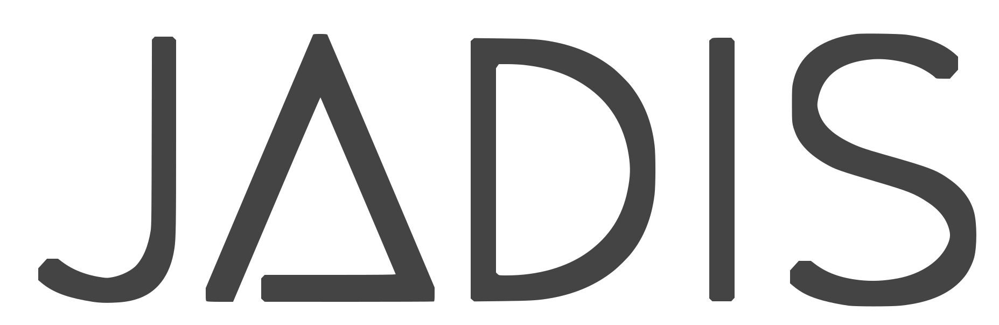

[](https://www.python.org/downloads/release/python-3813/)
[](https://creativecommons.org/licenses/by/4.0/)
[](https://github.com/BnF-jadis/SuperMapRealigner/issues)
[](https://zenodo.org/badge/latestdoi/638211649)

<!-- PROJECT LOGO -->
<br />
<div align="center">
  <a>
    
  </a>

  <h3 align="center">JADIS – SuperMapRealigner</h3>

  <p align="center">
    A Generic Method for Segmented Map Realignment using Local Features and Graph Neural Network
    <br />
    <a href="https://github.com/BnF-jadis/SuperMapRealigner/blob/ddfa08f1d9c74c678be785ef8a98e7f1e96cc1d4/SuperMapRealigner.ipynb">View Demo</a>
    ·
    <a href="https://github.com/BnF-jadis/SuperMapRealigner/issues">Report Bug</a>
  </p>
</div>

## About The Project

**SuperMapRealigner** is a method developed at EPFL, Swiss Federal Institute of Technology in Lausanne, based on the works of Maxime Jan [1] and Rémi Petitpierre [2-3], in collaboration with Paul Guhennec, under the direction of Frédéric Kaplan.

This research is an extension of the **JADIS project** [2], which stems from a scientific collaboration between the Bibliothèque nationale de France (BnF) and EPFL. The JADIS project resulted in the initial development of an algorithm to automatically realign map collections with street-level precision. SuperMapRealigner continues and improves the results of the project.

The method is composed of two steps. First, the road network is extracted from historical maps using semantic segmentation. This step relies on [open-mmlab/mmsegmentation](https://github.com/open-mmlab/mmsegmentation). Second, local features are detected in the road network and the maps are realigned on a contemporary reference map, using Superpoints and SuperGlue graph neural network [4]. The preparation and segmentation of the full-scale maps, as well as the generation of the reference anchor from OpenStreetMap data are performed using Jadis utilities.

### Evaluation

The accuracy of the realignment was evaluated on a corpus of 50 historical maps of Paris, using 250 control points annotated manually. The present algorithm allowed to realign accurately 38/50 maps (76%), with a median residual error of 16.7 ± 8.1 pixels (20 meters). This performance was confirmed on a sample of 20 historical maps from various European cities (see [1] for details).

The segmentation model is trained on the Historical City Maps Semantic Segmentation Dataset – Paris [5]. The road network segmentation performance reaches an IoU of 82.4 %. 

### References and related publications

<div><small>
<ol type = "1">
<li>Jan, Maxime F. ‘A Generic Method for Cartographic Realignment Using Local Feature Matching: Towards a Computational Urban History’. Master’s thesis, EPFL, 2022. <a href="https://github.com/JanMaxime/PDM">github.com/JanMaxime/PDM</a>.</li>
<li>Petitpierre, Rémi. ‘Projet JADIS’. Github. Paris: Bibliothèque nationale de France, 2020. v1.0-beta (beta). DOI: <a href="https://github.com/BnF-jadis/projet">10.13140/10.5281/zenodo.6594483</a></li>
<li>Petitpierre, Rémi. ‘Neural Networks for Semantic Segmentation of Historical City Maps: Cross-Cultural Performance and the Impact of Figurative Diversity’. Master’s thesis, EPFL, 2020. DOI: 
<a href="https://dx.doi.org/10.13140/RG.2.2.10973.64484">10.13140/RG.2.2.10973.64484</a>.</li>
<li>Sarlin, Paul-Edouard, Daniel DeTone, Tomasz Malisiewicz, and Andrew Rabinovich. ‘SuperGlue: Learning Feature Matching With Graph Neural Networks’, 4938–47, 2020. arXiv: <a href="https://arxiv.org/abs/1911.11763">1911.11763</a>
</li>
<li>Petitpierre, Rémi. ‘Historical City Maps Semantic Segmentation Dataset’. Zenodo, September 2021. DOI: <a href="https://doi.org/10.5281/zenodo.5497934">10.5281/zenodo.5497934</a></li>
</small></div>

## Setup
_Note that it is not necessary to install OpenMMLab libraries (steps 1 and 2) if you intend to run the demo on provided data._

1. Download and install [open-mmlab/mmsegmentation](https://github.com/open-mmlab/mmsegmentation) and [open-mmlab/mmcv](https://github.com/open-mmlab/mmcv), according to the instructions provided by OpenMMLab. We use mmsegmentation v1.0.0 (released Apr. 6th 2023).
2. Download and install [open-mmlab/mmdetection](https://github.com/open-mmlab/mmdetection). We use mmdetection v2.0.0 (released Apr. 6th 2023).
3. Finally, ensure that the following libraries are installed :

   ```pip install tqdm glob opencv-python scikit-image pillow scipy matplotlib overpass```

## Usage

### Segment your own maps

If you want to segment your own maps, after installing the relevant libraries (see previous sections), you can make use of the pretrained model. A script called `inference.py` will also help you segment full-scale maps, by tiling the map into smaller 640x640 patches, that can be ingested by the neural network, and reconstituted afterward.
  
1. Download the pretrained model from the [following link](https://drive.google.com/file/d/1bVtI1Wz3AatxPT8g5euk8tOlVrjBAclo/view?usp=share_link). 
2. Unzip the pretrained model. Place the `inference.py` script, found under `assets/segmentation`, and the `pretrained_paris` directory, in the `mmsegmentation/demo/` folder. Copy also the `utils` directory in the same location.
3. Place your map images in `mmsegmentation/documents/images/`. Create the directories if necessary.
4. You can then run the segmentation inference by executing `python inference.py` from a terminal, when located in `mmsegmentation/demo/`.

### Realign segmented maps

To use SuperMapRealigner, simply follow the `SuperMapRealigner.ipynb` Jupyter notebook. The execution of the script should take less than 5 minutes to realign the 49 maps from the demo, when using a recent mid-range GPU.

## License

<div><small>

Distributed under the license Creative Commons Attribution 4.0 International ([CC BY 4.0](https://creativecommons.org/licenses/by/4.0/)).

You are free to:
* Share — copy and redistribute the material in any medium or format
* Adapt — remix, transform, and build upon the material for any purpose, even commercially.

Under the following terms:
* Attribution — You must give appropriate credit, provide a link to the license, and indicate if changes were made. You may do so in any reasonable manner, but not in any way that suggests the licensor endorses you or your use.
* No additional restrictions — You may not apply legal terms or technological measures that legally restrict others from doing anything the license permits. 
</small></div>

## Contact

<a href="https://orcid.org/0000-0001-9138-6727">
 <a href="https://people.epfl.ch/remi.petitpierre">Rémi Petitpierre</a>
 - remi.petitpierre@epfl.ch
  
## Citation
  
Rémi Petitpierre. (2023). BnF-jadis/SuperMapRealigner: v0.1-initial. Zenodo. https://doi.org/10.5281/zenodo.638211649
```
@software{petitpierre_bnf-jadis_2020,
  author       = {R{\'{e}}mi Petitpierre},
  title        = {BnF-jadis/SuperMapRealigner: v0.1-initial},
  month        = May,
  year         = 2023,
  publisher    = {Zenodo},
  version      = {v0.1},
  doi          = {10.5281/zenodo.638211649},
  url          = {https://doi.org/10.5281/zenodo.638211649}
}
```

